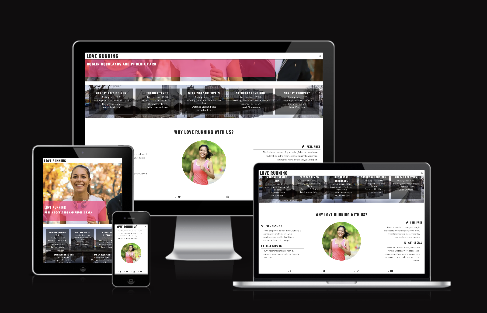

<div align="center">
	<h1>🏃‍♀️ Love Running</h1>
	<p><strong>A friendly, heart‑powered running club website for Dublin — my first project on this coding journey.</strong></p>
	<a href="https://ui.dev/amiresponsive?url=https://u22n.github.io/love-running-project/" target="_blank" rel="noopener">
		
	</a>
	<br>
	<em>Built with curiosity, caffeine, and a lot of iteration.</em>
</div>

---

## 🚀 About the Project
Love Running is a responsive, multi‑page static website for a fictional (but could be real!) Dublin running club. It showcases meetup schedules, motivation, community benefits, a photo gallery, and an accessible signup experience with dynamic feedback. This is the very first project I created as part of my coding course — a milestone where HTML, CSS, and a pinch of JavaScript came together and started feeling like a toolkit instead of a mystery.

The site aims to feel energetic, welcoming, and slightly playful without sacrificing usability or clarity. Gradients, subtle motion, and progressive enhancement are used sparingly to guide attention (e.g. the signup success panel and first‑visit welcome notification).

## 🖼️ Live Demo & Responsiveness
Use <a href="https://ui.dev/amiresponsive?url=https://u22n.github.io/love-running-project/" target="_blank" rel="noopener">

## 📂 Site Structure
```
index.html        # Home: hero, meetup schedule, reasons to join
gallery.html      # Gallery: multi-column responsive image layout
signup.html       # Signup: enhanced form with validation + success modal
assets/css/styles.css
assets/js/signup.js        # Form logic: validation + DNS domain check
assets/js/welcome.js       # Session-based welcome toast with progress bar
assets/favicon/...         # Favicons & manifest
assets/gallery-images/...  # Gallery imagery
```

## ✨ Key Features
- **Responsive Layout:** Mobile-first approach with fluid sections and breakpoint refinements.
- **Accessible Navigation:** Toggled mobile menu; semantic headings; ARIA labels on social links.
- **Dynamic Signup Form:** Inline validation, visual error states, DNS lookup to gently sanity‑check email domains, animated success panel with return action.
- **Session Welcome Toast:** One-time per session notification: focusable, escapable, auto-dismiss with progress bar and running icon.
- **Optimized Media Display:** Gallery uses CSS multi-columns to adapt image density to screen width.
- **Visual Hierarchy:** Carefully tuned font sizes, letter spacing, gradients, subtle shadows, and targeted animations (avoid motion overload).
- **Consistent Theme:** Warm tones (gold / coral / earthy greens) balanced with dark overlays for readability.

## ♿ Accessibility & UX Considerations
- High contrast for critical text (errors, headings, buttons on interaction states).
- Inline errors placed adjacent to inputs; screen readers can traverse them sequentially.
- `aria-live="polite"` used for the welcome toast; focus programmatically moved for announcement.
- Labels explicitly bound via `for` attributes; helper text uses `<small>` and clear language.
- Escape key support and close button for the toast (multiple dismissal pathways).
- Logical heading structure across pages.

## 🧪 Form Validation Flow
1. User enters details → inline checks for empty fields / invalid email pattern.
2. Quick DNS query (MX then A) on the email domain (best-effort; non-blocking if the lookup fails gracefully).
3. If domain seems invalid → prominent inline error message.
4. On success → animated overlay: personalized thank-you + optional domain note.

## 🛠️ Tech Stack
- **HTML5** semantic structure
- **CSS3** (flexbox, responsive columns, gradients, animations)
- **Vanilla JavaScript** (no frameworks; progressive, unobtrusive enhancement)
- **Font Awesome** icons
- **Google Fonts:** Oswald + Lato pairing for energetic headings & readable body text

## 📱 Responsive Design Notes
- Mobile: stacked, approachable; nav collapses under toggle.
- Tablet: multi-column gallery and adjusted spacing.
- Desktop: widened content zones, hero impact area, balanced negative space.

## 🔍 Performance & Optimization Choices
- Kept JavaScript light and modular; no heavy dependencies.
- Reused color palette to reduce cognitive overhead.
- SVG icons inline where animation or precise control desired.
- Avoided unnecessary reflows—animations use `transform` and `opacity`.

## 💡 What I Learned
Building this project taught me:
- How small layout decisions snowball into user experience quality.
- The importance of accessible feedback (errors should *help*, not scold).
- Progressive enhancement mindset: the form works even if DNS lookups fail.
- How to iterate: the signup panel, toast notification, and visual theme evolved through refinement rather than perfection upfront.

## 🔮 Future Enhancements
- Real backend integration (e.g. serverless form endpoint + confirmation email).
- User profiles / weekly mileage tracker.
- Dark mode toggle persisting via `localStorage`.
- Animated route maps (SVG path tracing for common runs).
- Performance budget audit with Lighthouse + image optimization via modern formats.

## 🧪 How to Run Locally
```bash
git clone https://github.com/u22n/love-running-project.git
cd love-running-project
# Open index.html in your browser (double click or use a lightweight server)
# Example (Python 3):
python3 -m http.server 8000
# Visit: http://localhost:8000
```

## ✅ Manual Test Checklist
- [ ] Navigation links work on all pages.
- [ ] Signup form rejects malformed email (e.g. `abc@xyz`).
- [ ] Signup success panel appears and return button navigates home.
- [ ] Welcome toast shows once per session, closes with Escape, progress bar shrinks.
- [ ] Gallery images scale and columns adjust at breakpoints.
- [ ] Social links open in new tab with correct `aria-label`s.

## 🖼️ Imagery & Assets
Images are representative running / fitness scenes used to convey energy and inclusivity. Replace or optimize as needed for production (consider compression + `loading="lazy"`).

## 🤝 Credits & Inspiration
- Course guidance & foundational structure inspired by my coding curriculum.
- Icons: Font Awesome.
- DNS query exploration: Cloudflare DoH API.
- Color inspiration: blending sunrise gold with energetic coral for momentum.

## 👋 Author
Hi, I’m **X** — this repository marks the start of my journey from “Can I really build something?” to “I *am* building things.” If you have ideas, questions, or feedback, feel free to open an issue or just say hi.

## 🪪 License
Currently no formal license applied. Treat the project respectfully; reach out before reuse.

---
<div align="center">
	<em>“Every step is a victory.” Thanks for reading & happy running! 🏃‍♂️</em>
</div>
